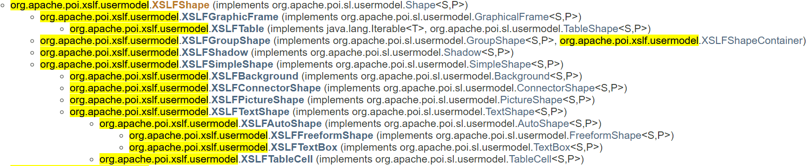

## 目录

+ ### 1.POI源码目录结构 及 shape模型
  + #### 1.1 开发环境
  + #### 1.2 POI源码目录结构
  + #### 1.3 Shape模型
  + #### 1.4 RenderableShape对象

+ ### 2.POI转PNG
  + #### 2.1 XSLFGroupShape 转PNG
  + #### 2.2 XSLFGraphicFrame 转PNG
  + #### 2.2 XSLFTable 转PNG
  + #### 2.4 XSLFGroupShape 转PNG
  + #### 2.5 XSLFShadow 转PNG
  + #### 2.6 XSLFSimpleShape 转PNG
  + #### 2.7 XSLFBackground 转PNG
  + #### 2.8 XSLFConnectorShape 转PNG
  + #### 2.9 XSLFPictureShape 转PNG
  + #### 2.10 XSLFTextShape 转PNG
  + #### 2.11 XSLFAutoShape 转PNG
  + #### 2.12 XSLFFreeformShape 转PNG
  + #### 2.12 XSLFTextBox 转PNG
  + #### 2.14 XSLFTableCell 转PNG

## 1.POI源码目录结构 及 shape模型

### 1.1 开发环境
  + JDK:1.8.0_111
  + Gradle:4.0
  + 测试PPT文件目录:/test-data
  + PPTX's Shape单元测试目录:/src/ooxml/org/apache/poi.xslf/usermodel

### 1.2 POI源码目录结构
项目地址:https://github.com/LiuJiJiJi/poi3.9
```sh
├── ApplicationName #项目路径
│   ├── .gradle
│   ├── .idea # Intellij Idea 环境
│   ├── build #构建输出目录
│   ├── maven # maven依赖配置文件
│   ├── src #源代码，资源等
│   │  ├──contrib
│   │  ├──documentation
│   │  ├──examples
│   │  ├──excelant
│   │  ├──java
│   │  ├──models
│   │  ├──ooxml ##主要研究对象
│   │  ├──records
│   │  ├──resources
│   │  ├──scratchpad
│   │  ├──testcases
│   │  ├──types
│   ├── test-data # 测试文件目录
│   └── .gitignore  # gitignore
│   └── buidle.gradle #工程构建文件
│   └── buidle.xml #工程构建文件
│   └── patch.xml #工程构建文件
│   └── settings.gradle #工程配置
├── External Liraies#类库、jar等
```

### 1.3 Shape模型

#### [Shape简介](http://www.officeopenxml.com/prSlide-shapeTree.php)
幻灯片的大部分内容都附在形状和表格上。(更多关于形状，请参阅DrawingML -形状;有关表的更多信息，请参见DrawingML - tables。表示幻灯片中的形状和表本身包含在父< p:spTree >元素中。
形状树可以包含图片、形状、连接和表(在< p:graphicFrame >元素中，见DrawingML - Overview)，以及形状组的形状和属性组。
在ecma - 376规范中，树也可能包含未定义的内容。
在< p:spTree >中，每个形状或其他对象都是z轴排序的独特级别。这意味着形状和对象在< p:spTree >中出现的顺序决定了当它们重叠时，
形状和对象相互叠加的顺序。树的第一个形状有最低的z阶，最后的形状是最高的。

#### Shape Xml 解析
|元素                      |描述|
|:----                           |:---  
|`<p:contentPart>`         |在没有ecma - 376规范定义的格式中指定对XML内容的引用，从而允许本机使用其他交换格式，如MathML、SMIL和SVG。
|`<p:cxnSp>`               |指定连接两个< p:sp >元素的连接形状。更多信息参见DrawingML -连接器。
|`<p:extLst>`              |允许扩展的规格，可以用来存储各种数据。        
|`<p:graphicFrame>`        |指定一个图形，例如由外部xml源生成的表或其他对象。该元素充当此类图形数据的容器。在演示文档和DrawingML - Overview中看到DrawingML -放置                
|`<p:grpSp>`               |指定一个组形状或两个或多个组合在一起的形状，以便在应用转换时将它们作为单个形状处理。其内容模型与< p:spTree >元素的内容模型相同。也就是说，它可以包含群组形状、群组形状属性、非视觉群组形状属性、形状、图片、连接器等。         
|`<p:grpSpPr>`             |为组形状指定一组属性。内容模型非常类似于形状的属性，只是它不包含任何几何形状，因为很明显，这个组的形状是由组成它的形状的独立几何图形决定的。另外，2D转换(< a:xfrm >，定义大小(< a:ext >)和边界框的位置(< a:off >)，包含额外的子元素< a:chExt >和< a:chOff >。这些表示孩子的范围和子偏移量。参见DrawingML -形状-更多的视觉属性。           
|`<p:nvGrpSpPr>`           |为组形状指定一组非视觉属性。内容模型非常类似于一个形状的非视觉属性，除了一个子元素< p:cNvSpPr >有一个< p:cnvgrpspsppr >。还要注意，在演示中，有一个< p:nvPr >元素，它包含与对象关联的多媒体内容，以及形状占位符(参见幻灯片——概述)。参见DrawingML -形状-更多的非视觉属性。<p:nvGrpSpPr>子元素1.`<p:cNvGrpSpPr>` ==>定与组中锁定相关的非可视组形状属性(是否可以移动、调整大小、旋转等)。参见< p:splock >元素的单个形状的讨论，它对应于< p:grpSpLocks >在这里进行分组。2.<p:cNvPr>==>指定绘图画布的非视觉属性，如id、名称、描述、组是否隐藏等。参见< p:cNvPr >元素对单个形状的讨论。3.<p:nvPr>==>指定与对象关联的多媒体(参见幻灯片-内容-多媒体)，以及幻灯片内容的占位符(< p:ph>元素)(参见幻灯片-概述)。
|`<p:pic>`                 |`指定图片的存在。详见DrawingML -图片。`
|`<p:sp>`                  |`指定形状的存在。详见DrawingML -形状。`

#### XSLFShape 分析
[XSLFShape](http://poi.apache.org/apidocs/overview-tree.html)
 Shape 包含绘图、形状、OLE 对象、图片、文本对象、标题、页眉、页脚、幻灯片编号以及日期和时间对象，这些对象位于幻灯片上或备注页中的幻灯片图像上。

      1. XSLFShape :在PresentationML中为所有形状建立超类
      2. XSLFGraphicFrame :条形图等等..
      3. XSLFTable :pptx中的表
      4. XSLFGroupShape :表示一个由许多形状组合在一起的组形。
      5. XSLFShadow :代表一个形状的影子。目前只支持外部阴影。
      6. XSLFSimpleShape :表示pptx中的单个(非组合)形状。
      7. XSLFBackground :背景轮廓
      8. XSLFConnectorShape :指定一个连接的形状(箭头,指针等等..)。
      9. XSLFPictureShape :代表一个图片的形状
      10. XSLFTextShape :表示可以保存文本的形状。
      11. XSLFAutoShape :表示一个具有预设几何形状的图形。
      12. XSLFFreeformShape :表示自定义几何形状。这个形状将由一系列在创建路径中描述的线和曲线组成。
      13. XSLFTextBox :表示文本形状。
      14. XSLFTableCell :表示pptx中的表的单元格。


### 1.4 RenderableShape对象
RenderableShape是poi为SimpleShape封装的一个绘画工具类,后面我们的很多Shape都会用`rShape.render()`,将shape粉刷到画布上
  + 使用方法
  ```java
  RenderableShape rShape = new RenderableShape(shape);
  rShape.render(graphics);
  ```
  + 实现逻辑
  render(Graphics2D graphics)
  ```java
  public void render(Graphics2D graphics){
      Collection<Outline> elems = computeOutlines(graphics);

      // 获取当前shape的阴影
      XSLFShadow shadow = _shape.getShadow();

      // 获得Fill Paint 和 line Paint
      Paint fill = getFillPaint(graphics);
      Paint line = getLinePaint(graphics);
      applyStroke(graphics);

      // First: 画阴影
      if(shadow != null) for(Outline o : elems){
          if(o.getPath().isFilled()){
              if(fill != null) shadow.fill(graphics, o.getOutline());
              else if(line != null) shadow.draw(graphics, o.getOutline());
          }
      }
      // Second: 画内部形状
      if(fill != null) for(Outline o : elems){
          if(o.getPath().isFilled()){
              graphics.setPaint(fill);
              graphics.fill(o.getOutline());
          }
      }

      // Third: 画内容(text, image, etc.)
      _shape.drawContent(graphics);

      // Fourth: 描出形状轮廓
      if(line != null) for(Outline o : elems){
          if(o.getPath().isStroked()){
              graphics.setPaint(line);
              graphics.draw(o.getOutline());
          }
      }
  }
  ```

## 2.POI转PNG

### 2.1 XSLFShape 转PNG
XSLFShape是一个抽象类,其它的Shape都继承了它,主要看下他的几个方法:
```
getAnchor() @return 这个形状的位置在画布的位置。坐标是用点表示的
setAnchor(Rectangle2D anchor) @param 这个形状的位置在画布的位置
getXmlObject() @return 持有该形状数据的xml bean
getShapeName() @return 这个形状的名字
getShapeId() @return 这个形状的唯一id
setRotation(double theta) @param 旋转的角度
getRotation() @return 旋转的角度
setFlipHorizontal(boolean flip) @param 翻转形状是否水平翻转
setFlipVertical(boolean flip) @param 翻转形状是否垂直翻转
getFlipHorizontal() @return 翻转形状是否水平翻转
getFlipVertical() @return 翻转形状是否垂直翻转
draw(Graphics2D graphics) @param 将这个形状绘制到提供的画布中
applyTransform(Graphics2D graphics) 在绘制此形状之前,进行2-d转换。这包括旋转和翻转。
copy(XSLFShape sh) 拷贝形状
```
XSLFShape的draw是一个抽象方法,`XSLFBackground`、`XSLFGraphicFrame`、`XSLFGroupShape`、`XSLFSimpleShape`实现了该抽象方法,后面可以重点留意这四个类的draw方法


<!-- #### 2.4 XSLFGroupShape 转PNG
先用wps创建一个XSLFGroupShape.pptx文件,在ppt上画出一个 **长方形文本框** 和一个 **圆形文本框**,按住Ctrl键选中两个图形将其组合成一个 **GroupShape**

接下来就用poi读取/test-data/myPPT/XSLFGroupShape.pptx中的GroupShape,然后将其转换成图片 -->

### 2.6 XSLFSimpleShape 转PNG
先用wps创建一个XSLFSimpleShape.pptx文件,在ppt上画出一个 **长方形文本框**(AutoShape属于SimpleShape)

接下来就用poi读取/test-data/myPPT/XSLFSimpleShape.pptx中的SimpleShape,然后将其转换成图片
**RenderableShape** 是poi为XSLFSimpleShape封装的一个粉刷对象,粉刷流程是:画阴影==>填充内部的形状==>在此形状内绘制内容==>描出形状轮廓
```java
/**
 * SimpleShape to Png
 * @throws Exception
 */
@Test
public void testToPng() throws Exception {

    //从PPT中读取Shape
    XMLSlideShow ppt = new XMLSlideShow(new FileInputStream("../../test-data/myPPt/XSLFSimpleShape.pptx"));
    XSLFSlide[] slides = ppt.getSlides();
    XSLFSlide slide = slides[0];
    XSLFShape[] shapes = slide.getShapes();
    XSLFSimpleShape shape = (XSLFSimpleShape) shapes[0];

    // 创建画布
    Dimension pgsize = ppt.getPageSize();
    BufferedImage img = new BufferedImage((int)pgsize.width, (int)pgsize.height, BufferedImage.TYPE_INT_RGB);
    Graphics2D graphics = img.createGraphics();
    graphics.setPaint(Color.white);
    graphics.fill(new Rectangle2D.Float(0, 0, pgsize.width, pgsize.height));

    // 构造RenderableShape类 粉刷 画布
    RenderableShape rShape = new RenderableShape(shape);
    rShape.render(graphics);

    FileOutputStream out = new FileOutputStream("../../test-data/myPPt/XSLFSimpleShape.png");
    javax.imageio.ImageIO.write(img, "png", out);
    out.close();
}
```

### 2.7 XSLFBackground 转PNG
先用wps创建一个XSLFBackground.pptx文件,然后将幻灯片用一张背景图片填充

接下来就用poi读取/test-data/myPPT/XSLFBackground.pptx中的XSLFBackground.pptx,然后将其转换成图片
```java
/**
 * Backgroud to Png
 * @throws Exception
 */
@Test
public void testToPng() throws Exception {

    //从PPT中读取Backgroud
    XMLSlideShow ppt = new XMLSlideShow(new FileInputStream("../../test-data/myPPt/XSLFBackGroud.pptx"));
    XSLFSlide[] slides = ppt.getSlides();
    XSLFSlide slide = slides[0];
    XSLFBackground background = slide.getBackground();

    // 创建画布
    Dimension pgsize = ppt.getPageSize();
    BufferedImage img = new BufferedImage((int)pgsize.width, (int)pgsize.height, BufferedImage.TYPE_INT_RGB);
    Graphics2D graphics = img.createGraphics();
    graphics.setPaint(Color.white);
    graphics.fill(new Rectangle2D.Float(0, 0, pgsize.width, pgsize.height));

    // 读取尺寸 位置
    Rectangle2D anchor = background.getAnchor();
    // 获取背景属性
    CTBackground bg = (CTBackground) background.getXmlObject();
    XmlObject spPr = bg.getBgPr();
    // 构造RenderableShape类,用RenderableShape.getPaint方法获取paint(油漆)
    RenderableShape rShape = new RenderableShape(background);
    Paint fill = rShape.getPaint(graphics, spPr, null);
    if(fill != null) {
        // 将paint写入到画布中
        graphics.setPaint(fill);
        // 设置画布填充尺寸 和 位置
        graphics.fill(anchor);
    }

    // 输出画布图片
    FileOutputStream out = new FileOutputStream("../../test-data/myPPt/XSLFBackGroud.png");
    javax.imageio.ImageIO.write(img, "png", out);
    out.close();
}
```
看到转出来的图片完全变样了(对照上面截图)


1. **查问题**:
    + 在Paint fill = rShape.getPaint(graphics, spPr, null);打个断点看看获取的Paint里面有什么
    
    + Paint里面有张bufImg,width=1920px height=1200px。sx(x轴缩放比)=1.0,sy(y轴缩放比)=1.0
    + 而幻灯片的width=960px height=540px,**这就说明获取的图片尺寸/缩放比有问题**,我们可以试着调整缩放比 或者 修改图片尺寸让其自适性
2. **查找处理Paint的类**    
    + 我们再点到rShape.getPaint方法里看看,他这这里直接调了内部方法selectPaint()
    + 再点到RenderableShape.selectPaint()里面看看,官方对该方法的介绍是转换形状填充到java.awt.paint.
    + 从上面的截图可以看到,selectPaint分别对No Fill(空填充)、Solid Fill(颜色填充)、Blip Fill(纹理/图片填充)、Gradient Fill(渐变填充)。我们的bug是图片背景填充，那我们就重点看Blip Fill。
    + 我们看到当背景填充为Blip Fill时,`paint = createTexturePaint(blipFill, graphics, parentPart);`,那我们再看下他的**createTexturePaint**方法
    + 再看createTexturePaint()前,我们先看下TexturePaint类的介绍:TexturePaint类提供了一种方法来填充一个纹理，它被指定为BufferedImage。纹理通过概念上复制指定的矩形在用户空间中的所有方向，并将BufferedImage映射到每个复制的矩形，以计算设备空间中的位置。
    + 根据TexturePaint类介绍,那我们就着重看他的BufferedImage处理。
    + 卧槽终于找到问题点了,原来他new TexturePaint(BufferedImage,Rectangle2D)直接把图片的大小给到TexturePaint.这就是导致我们在paint里看到是图片的大小,而不是其容器的尺寸
3. **解决方案**    
    + 方案一:修改图片尺寸(src/ooxml/java/org.apache.poi.xslf.usermodel.RenderableShape:131) new TexturePaint(BufferedImage,Rectangle2D) 我直接将其父容器的尺寸赋值给TexturePaint。
    ```java
    if(img != null) {
        paint = new TexturePaint(img, _shape.getAnchor());
    }
    ```
    我们再打个断点看看paint属性,他已经计算好了缩放比960/1920=0.5 540/1200=0.45。再看下/test-data/myPPt/XSLFBackGroud.png 也和ppt上的尺寸一样
    

### 2.10 XSLFTextShape 转PNG
XSLFTextShape是一个抽象类,`XSLFAutoShape`、`XSLFTableCell`、`XSLFTextBox`、`XSLFFreeformShape`都继承了他,我们看下他的内部方法(主要是文本 间距 样式 等等。。):
```sh
getText() @return 返回该形状中包含的字符串
clearText() 初始化这个形状
setText(String text) @param 设置该形状的字符串为
getTextParagraphs() @return 该形状内的 文本段落列表
addNewTextParagraph() @return 为该形状添加一个文本段落
setVerticalAlignment(VerticalAlignment anchor) @param 设置该形状的垂直对齐
getVerticalAlignment() @return 获取该形状的垂直对齐
setTextDirection(TextDirection orientation) @param 设置垂直方向
getTextDirection() @return 垂直方向
getBottomInset() @return 底部间距
getLeftInset() @return 左边间距
getRightInset() @return 右边间距
getTopInset() @return 顶部间距
setBottomInset(double margin) @param 设置底部间距
setLeftInset(double margin) @param 设置左边间距
setRightInset(double margin) @param 设置右边间距
setTopInset(double margin) @param 设置顶部间距
getWordWrap() @param 是否在边界矩形内包装单词
setWordWrap() @param 设置是否在边界矩形内包装单词
setTextAutofit() 设置最适合的形状(自适应)
getTextAutofit() 获取最适合的形状
getTextBodyPr
getTextBody
getTextType
setPlaceholder(Placeholder placeholder) @param 设置占位符
getTextHeight() 计算文本累计高度
resizeToFitText() 调整形状的大小，让它包含里面的文字。(自适应)
breakText(Graphics2D graphics) 将所包含的文本分解成行
drawContent(Graphics2D graphics) 将内容画到画布上
drawParagraphs(Graphics2D graphics) 将段落画到画布上
copy
_paragraphs 该形状的所有段落
_isTextBroken ppt在此处是否停顿
```      

### 2.11 XSLFAutoShape 转PNG
先用wps创建一个XSLFAutoShape.pptx文件,创建一个AutoShape

接下来就用poi读取/test-data/myPPT/XSLFAutoShape.pptx中的AuytoShape,然后将其转换成图片
```java
/**
 * AutoShape to Png
 * @throws Exception
 */
@Test
public void testToPng() throws Exception {

    //从PPT中读取Shape
    XMLSlideShow ppt = new XMLSlideShow(new FileInputStream("../../test-data/myPPt/XSLFAutoShape.pptx"));
    XSLFSlide[] slides = ppt.getSlides();
    XSLFSlide slide = slides[0];
    XSLFShape[] shapes = slide.getShapes();
    XSLFAutoShape shape = (XSLFAutoShape) shapes[0];

    // 创建画布
    Dimension pgsize = ppt.getPageSize();
    BufferedImage img = new BufferedImage((int)pgsize.width, (int)pgsize.height, BufferedImage.TYPE_INT_RGB);
    Graphics2D graphics = img.createGraphics();
    graphics.setPaint(Color.white);
    graphics.fill(new Rectangle2D.Float(0, 0, pgsize.width, pgsize.height));

    // 遍历AutoShape中的 所有段落,设置字体为`微软雅黑`
    List<XSLFTextParagraph> paragraphList = shape.getTextParagraphs();
    for (XSLFTextParagraph x: paragraphList) {
        List<XSLFTextRun> textRunList = x.getTextRuns();
        for (XSLFTextRun r:textRunList) {
            r.setFontColor(Color.RED);
            r.setFontFamily("微软雅黑");
        }
    }

    //AutoShape 继承了 SimpleShape 和 TextShape
    //构造RenderableShape对象 用 RenderableShape.render将autoShape画到画布上
    RenderableShape rShape = new RenderableShape(shape);
    rShape.render(graphics);

    //输出图片
    FileOutputStream out = new FileOutputStream("../../test-data/myPPt/XSLFAutoShape.png");
    javax.imageio.ImageIO.write(img, "png", out);
    out.close();
}
```

### 2.12 XSLFFreeformShape 转PNG
先用wps创建一个XSLFFreeFormShape.pptx文件,创建一个FreeFormShape

接下来就用poi读取/test-data/myPPT/XSLFFreeFormShape.pptx中的FreeFormShape,然后将其转换成图片
```java
/**
 * FreeFormShape to Png
 * @throws Exception
 */
@Test
public void testToPng() throws Exception {

    //从PPT中读取Shape
    XMLSlideShow ppt = new XMLSlideShow(new FileInputStream("../../test-data/myPPt/XSLFFreeFormShape.pptx"));
    XSLFSlide[] slides = ppt.getSlides();
    XSLFSlide slide = slides[0];
    XSLFShape[] shapes = slide.getShapes();
    XSLFFreeformShape shape = (XSLFFreeformShape) shapes[0];

    // 创建画布
    Dimension pgsize = ppt.getPageSize();
    BufferedImage img = new BufferedImage((int)pgsize.width, (int)pgsize.height, BufferedImage.TYPE_INT_RGB);
    Graphics2D graphics = img.createGraphics();
    graphics.setPaint(Color.white);
    graphics.fill(new Rectangle2D.Float(0, 0, pgsize.width, pgsize.height));

    // 构造RenderableShape类 粉刷 画布
    RenderableShape rShape = new RenderableShape(shape);
    rShape.render(graphics);

    FileOutputStream out = new FileOutputStream("../../test-data/myPPt/XSLFFreeFormShape.png");
    javax.imageio.ImageIO.write(img, "png", out);
    out.close();
}
```
`XSLFFreeformShape`提供了一个方法getPath(),可以获取shape内的几何图形,通过打断点我们看到里面有14个点对应我们在ppt上画的14个点

